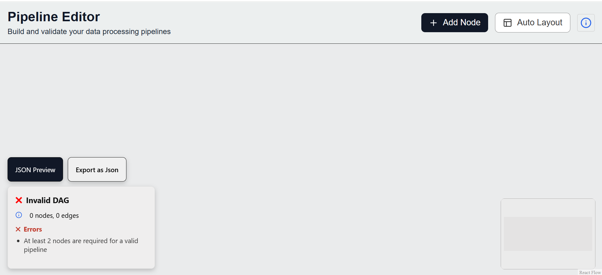
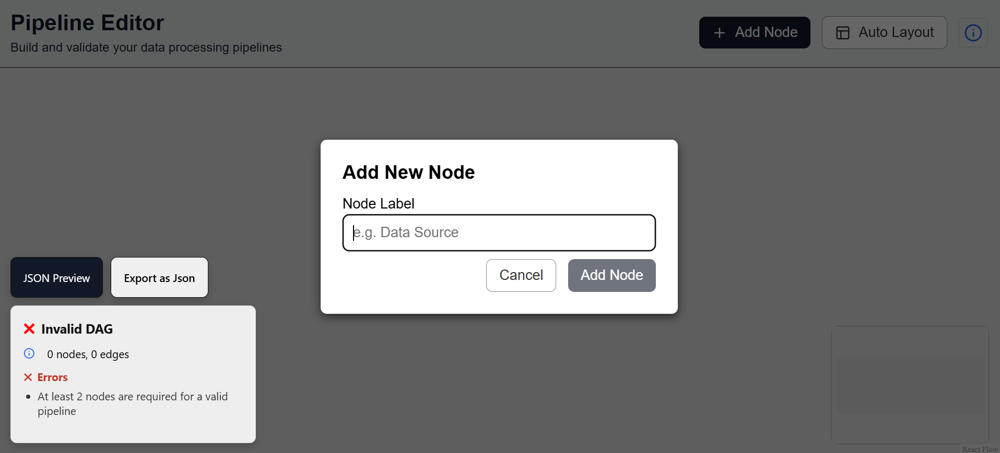
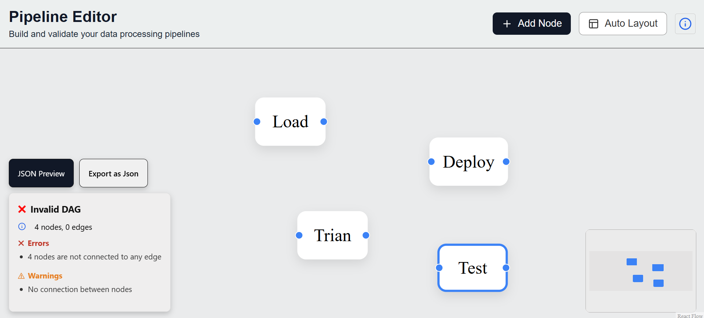
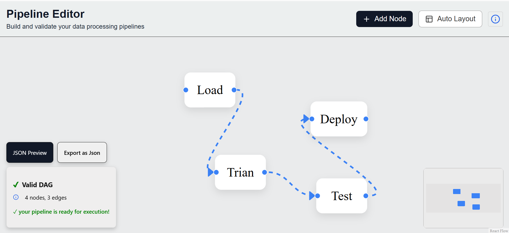
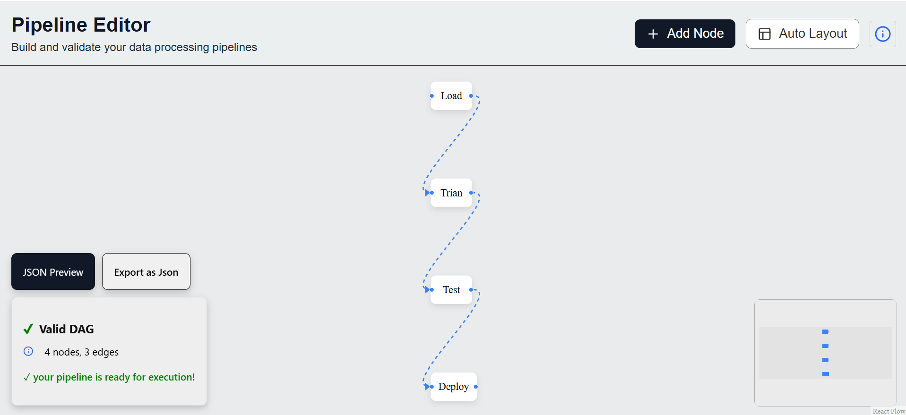
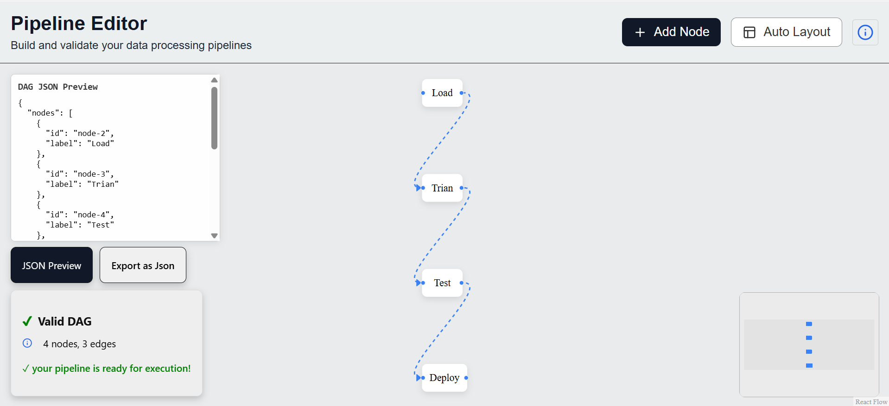

# DAG Builder (React + ReactFlow)

An interactive Directed Acyclic Graph (DAG) Builder built with React and ReactFlow. Users can create nodes, connect them with edges, validate pipelines in real-time, and now export their DAG structure as a downloadable JSON file.

---

## Demo

 **Live Demo**  [Live Demo](https://pipeline-editor-omega.vercel.app/)  
 **Video Demo**  [Video Demo]()  
 
### Main Screen  
### Add Node  
### Invalid DAG  
### Valid DAG  
### AutoLayout  
### JSON preview  

---

## Tech Stack

- **React** (Functional Components + Hooks)
- **ReactFlow** for DAG rendering and manipulation
- **Lucide React** for icons
- **Custom Hooks** for DAG validation
- **Plain CSS**

---

## Features

-  Add/Remove/Connect nodes interactively
-  Undo/Redo and Auto Layout
-  Real-time DAG Validation (Cycle detection, required structure check)
-  **Export Pipeline as JSON** (click to download structure)
-  JSON View panel for debugging
-  Pointer cursor on buttons for better interaction
-  MiniMap Support
-  Node deletion enable multinade deletion(using ctrl+click)

---

## How to Run Locally

```bash
# Clone the repo
git clone https://github.com/uday4002/pipeline-editor.git
cd pipeline-editor

# Install dependencies
npm install

# Start dev server
npm run dev    # or npm start
```
---

## Export Feature
After building your pipeline:
- Click “Export as JSON”
- A .json file downloads containing all nodes and edges
- You can re-use this for loading pipelines in the future

---

## Design Decisions

- **ReactFlow** for visual customization
- **DFS-based cycle detection** for real-time pipeline validation
- **UI Enhancements**:
  - Blue-colored handles and edges for visual clarity
  - Pointer cursor styling for all clickable elements
  - Export button to download DAG structure as JSON
- **Delete Feature**: Enabled node/edge removal via `Delete` key for quick edits
- **Validation Panel**: Dynamic panel displays feedback (e.g., cycle detected, structure valid/invalid)
- **MiniMap Integration**: Helps visualize and navigate large graphs

---

## Challenges Faced

- Keeping DAG validation real-time yet performant
- Handling all cases for valid DAG
- Styling ReactFlow handles & edges dynamically
- Cursor override conflicts with default styles
- UX around saving pipeline state without a backend
